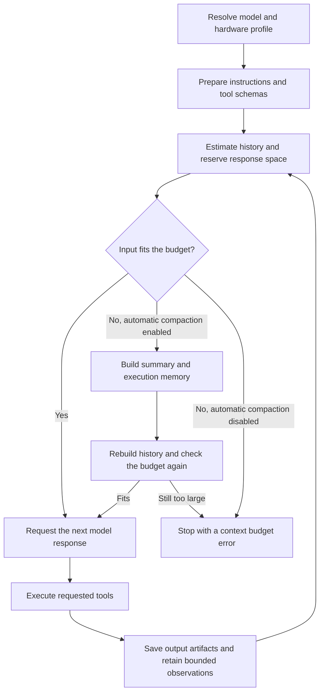

# Dynamic context shifting

[Documentation](README.md) / Dynamic context shifting

Eirene keeps ongoing work within a model's context budget by adapting the
instructions and tools it sends, limiting tool observations, and replacing long
conversation history with a compact handoff. For local Ollama models, these
controls also account for model size and host hardware. Together, these mechanisms
form the dynamic context shifting described in the project README.

The active model continues the task using a smaller working context. Context
shifting does not switch models or increase a model's supported context window.
Its purpose is to retain useful task state while making room for subsequent
reasoning and execution.

## Request flow



The budget check runs before each model request in the managed agent loop,
including requests after tool execution. A response without further tool calls
can finish the turn; the diagram shows the continuing tool cycle.

## 1. Resolve the local profile

The `ollama-local` provider inspects host RAM, CPU thread count, and available GPU
information. It requests model details from Ollama's `/api/show`, caches those
details, and uses the reported parameter size or a model-name fallback to choose
a profile.

| Profile | Context allowance | Maximum response tokens | Work-batch rounds |
| --- | ---: | ---: | ---: |
| Compact | 4,096 | 1,024 | 5 |
| Balanced | 8,192 | 4,096 | 12 |
| Full | 32,768 | 16,384 | 40 |

Profile selection applies these rules in order:

1. Choose compact when RAM is below 12 GB, CPU threads are at most two, the model
   has at most 4.5 billion parameters, or model size is unknown and no GPU memory
   is detected.
2. Otherwise, choose balanced for models with at most 10 billion parameters.
3. Otherwise, choose balanced when GPU memory is below 8 GB or RAM is below 24 GB.
4. Choose full for the remaining cases.

Hardware detection is conservative: NVIDIA presence uses an 8 GB estimate, and
Apple Silicon uses half of physical RAM as its graphics/model memory estimate.
These profiles are runtime heuristics rather than measured model benchmarks.

The provider's effective context is the smaller of the profile allowance and
the model's advertised context length, when available. An exact-model entry in
`model_context_limits` can reduce the agent's budget further. Increasing that
setting does not override the local profile or the model's advertised limit.
Ollama requests receive the provider's effective context through `num_ctx`.

## 2. Adapt instructions and tools

Compact and balanced profiles replace the general system prompt with shorter
operating instructions. These retain environment facts, permission guidance,
bounded-read practices, and execution rules. The implementation also retains the
instruction suffix containing enabled skill routes, current command guidance,
plugin guidance, and MCP instructions when those sections are present.

The compact profile exposes a focused set of file, search, edit, command, web,
and process tools. Balanced adds image reading, project information, diagnostics,
and symbol navigation. Available MCP tools remain eligible, and plugin support
adds its associated tools when present. Full preserves the original instructions
and tool catalog.

This reduces instruction and schema overhead before conversation history needs
to be summarized. Configured response and iteration limits can lower the profile
allowances; they cannot raise them.

## 3. Calculate the conversation budget

For a local model, the agent calculates:

```text
hard_limit = min(local effective context, configured model limit if present)
response_reserve = effective max_tokens + 256
input_budget = min(context_warning, hard_limit - response_reserve)
history_budget = input_budget - instruction_and_tool_overhead
```

`context_warning` defaults to 60,000 estimated tokens. A value of zero currently
falls back to that default. The agent estimates instructions, serialized tool
schemas, message content, and tool arguments using roughly one token per four
characters; this is an approximation rather than the model's tokenizer.

For example, a compact profile with a 4,096-token effective context and a
1,024-token response allowance leaves an input budget of 2,816 tokens. If
instructions and tools occupy an estimated 900 tokens, history has approximately
1,916 tokens available. These numbers illustrate the calculation, not a fixed
size for every compact-profile conversation.

If history plus overhead fits, execution continues directly. Otherwise, the
agent compacts the conversation when `auto_compact` is enabled, which is the
default. With automatic compaction disabled, it returns a context budget error.

## 4. Build a compact handoff

Compaction requires at least three messages and constructs two complementary
records:

- **Conversation summary:** the active model summarizes earlier requests,
  decisions, and progress. When a context limit is supplied, the transcript is
  processed in bounded chunks, carrying a rolling summary into the next chunk.
  These summary requests use no tools and cap output at 512 tokens or less.
- **Execution memory:** code extracts observations from recorded tool results,
  independently of the generated summary. Each retained entry identifies the
  tool, its target, a shortened result, failure status, and any output artifact.
  Recent observations take priority within a bounded character allowance.

Execution memory distinguishes a returned result from a failed action. The
handoff explicitly tells the model that starting a command is not proof of its
completion, and that pending work still requires verification.

The previous active message history is saved as an output artifact. The new
history contains the summary, an execution handoff with that artifact reference,
and a safe recent tail, normally around four messages. Tail selection avoids
orphaned tool results and unfinished assistant tool-call groups.

For automatic local compaction, recent tool result bodies are shortened to
800 characters. Older tail groups are removed if necessary, and the latest user
request is restored if it would otherwise be absent. If the rebuilt history
still exceeds its target, compaction fails rather than intentionally sending an
oversized conversation. The agent also checks the complete input budget again
before resuming.

Summarization has a 60-second overall deadline. If it fails during automatic
compaction, Eirene falls back to bounded quotations of earlier user instructions
alongside execution memory. Manual compaction reports summarization failures.
The session log appends a `compact` record containing the replacement history;
earlier log records remain on disk.

## 5. Bound new tool observations

After tool execution, Eirene calculates how much context remains after history,
instructions, tools, response reserve, and a small per-result allowance. Tool
observations receive a character budget derived from that remaining space. For
local profiles, the output ceiling is the smaller of 12,000 characters and half
the profile's context-token allowance, used as a character cap.

When multiple results share a budget, the available space is divided between
them. Oversized observations retain a bounded excerpt and, when space permits,
an artifact reference with instructions for retrieving additional pages through
`read_output`. This allows detailed output to stay available outside the active
model context. Artifact storage has its own limits; see
[data layout](data-layout.md).

## Continuation and error recovery

Context shifting preserves evidence used by the execution loop's recovery
controls. Local work can continue in another batch when recent tool outcomes
change. When progress stalls, the agent first directs the model to reassess the
unfinished objective; persistent stalls can require a user choice to continue,
try another approach, or pause and switch models.

The loop also detects repeated tool-call batches with unchanged outcomes and
redirects local models toward a different action. Truncated local responses can
receive up to two continuation attempts; incomplete tool calls from those
responses are marked unexecuted. These controls support correction and
continuation, but do not establish that every task or proposed fix is correct.
Verification still depends on the checks performed and their recorded results.

## Controls and scope

Use `/usage` to inspect estimated active context and `/compact` to request a
manual summary after the current response finishes. See
[context and usage](context-and-usage.md) for these commands and
[configuration](config-file.md#context-limits-and-cost-rates) for
`auto_compact`, `context_warning`, `model_context_limits`, and `max_tokens`.

General managed API providers also use budgeting and compaction, with a
2,048-token overhead reserve instead of the local profile's 256. The adaptive
profiles described here apply specifically to `ollama-local`. Installed Codex and
Claude Code CLI connections own their context handling and bypass Eirene's
managed budgeting loop.

The summary transcript itself bounds tool-result excerpts to 600 characters and
very long transcripts to 120,000 characters, retaining the beginning and recent
end. Summaries and bounded observations can omit details. Retrieve the saved artifact
or inspect the relevant project files when exact evidence is needed. A smaller
working context helps accommodate long tasks, but does not guarantee successful
tool use by an otherwise unsuitable model.

## Implementation references

| Source | Responsibility |
| --- | --- |
| [`local_profile.py`](../eirene/providers/local_profile.py) | Hardware detection, profile selection, instruction and tool adaptation. |
| [`ollama.py`](../eirene/providers/ollama.py) | Model metadata, effective local context, and Ollama request options. |
| [`agent.py`](../eirene/core/agent.py) | Pre-request budgeting, observation limits, continuation, and recovery. |
| [`compact.py`](../eirene/core/compact.py) | Bounded summarization, fallback, safe tail, and history reconstruction. |
| [`tool_memory.py`](../eirene/core/tool_memory.py) | Factual execution memory and bounded output with artifact references. |
| [`usage.py`](../eirene/core/usage.py) | Token estimation and usage accounting. |
| [`session.py`](../eirene/core/session.py) | Replacement history and append-only compaction records. |
